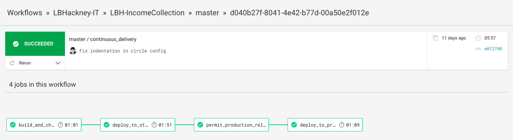

# Hackney Income Collection Service

# Development

## Installation

1. Install [Docker Community Edition](docker-install)
2. Run `make setup`
3. Checkout apis: 
    - [lbh-income-api](lbh-income-api)
    - [LBHTenancyAPI](LBHTenancyAPI)
    - [universal-housing-simulator](universal-housing-simulator)
4. Rename the `.env.test` to `.env` and set the variables

[docker-install]: https://docs.docker.com/install/
[lbh-income-api]: https://github.com/LBHackney-IT/lbh-income-api
[LBHTenancyAPI]: https://github.com/LBHackney-IT/LBHTenancyAPI
[universal-housing-simulator]: https://github.com/LBHackney-IT/universal-housing-simulator

## Serve the application

```sh
make run-all
```

## Run tests

```
make test
```

## Run linter

"Linters" run static analysis on code to ensure it meets style standards. We use [Rubocop](rubocop) on this project with a permissive configuration.

```
make lint
```

[rubocop]: https://github.com/rubocop-hq/rubocop

## Adding gems

1. Add your gem to the Gemfile.
2. Run `make bundle`. This will update the Gemfile.lock, and rebuild the docker image.

# Making changes

1. Follow the instructions in Installation to get set up.
2. Decide with your team on a small slice of work to pick up.
3. Create a branch to work off. Name it appropriately. `git checkout -b my-cool-feature`
4. Develop with TDD!
5. Commit your changes.
6. Check your code style is good and tests are passing using `make check`
7. Make a pull request on the [Github repo](github-repo).
8. Post a link in #team-collection-devs for review.
9. Make any changes if necessary and get another review.
10. Merge into master.
11. Deploy to staging and test manually. Ask someone else to take a look as well, whether they're a developer, user or other team member.
12. Deploy to production!

[github-repo]: https://github.com/LBHackney-IT/LBH-IncomeCollection

# Deployment Pipeline



1. Log in to CircleCI with Github and connect to the repo.
2. Successful merges to the `master` branch are built automatically by CircleCI.
3. After a successful build, the application is automatically released to [staging](staging).
4. After manually reviewing on staging, when you're happy to release to production, click to permit.
5. The application will be automatically released to [production](production).

The configuration for releasing changes is in `.circleci/config.yml`

[staging]: https://lbhincomecollectionstaging.herokuapp.com/
[production]: https://lbhincomecollectionproduction.herokuapp.com/

# Infrastructure

The staging and production applications are hosted on Heroku. You will need to talk to Rashmi Shetty to get added as a collaborator to the apps.

## Static IP addresses

To communicate with the Hackney API, which is hosted on premises, we need whitelisted static IP addresses for the Heroku instances outbound traffic. They are provided by QuotaGuard Static as a Heroku addon, you can find them in the addon config.

## User Access

Users log in via their Hackney Active Directory account. In order to log in, the user will need to be added to the `Manage Arrears-Azure` group on [Azure Active Directory](https://portal.azure.com). To get added to the group, contact one of the developers or maintainers on the contacts list.

There are three enterprise applications configured, one for each environment (dev, staging, production). These are all configured to use the same authentication group, so access to the group grants access to all environments.

Currently, users logging in will default to a `base_user` and will not be assigned cases.

# Notifications

SMS messages are sent using [Gov Notify](gov-notify). Templates are configured there, request access permission from a member of the team. Permitted variables are gathered from a tenancy reference by the application. They include:

- **title** - Title of primary contact, e.g. "Mr."
- **first name** - First name of primary contact, e.g. "Richard"
- **last name** - Surname of primary contact, e.g. "Foster"
- **full name** - Full name with title of primary contact, e.g. "Mr. Richard Foster"
- **formal name** - Formal title and surname of primary contact, e.e. "Mr. Foster"

[gov-notify]: https://www.notifications.service.gov.uk/

While developing, you can include yourself as a false tenancy to test communications by specifying the following environment variables:

```sh
DEVELOPER_TITLE=Miss
DEVELOPER_FIRST_NAME=Test
DEVELOPER_LAST_NAME=User
DEVELOPER_PHONE_NUMBER=01234 567890
DEVELOPER_EMAIL_ADDRESS=test@example.com
```

# Scripts

- **rails stub_data:scheduled_tasks** - Creates scheduled tasks for developer tenancies locally.

# Contacts

- Rashmi Shetty - Development Manager at Hackney (rashmi.shetty@hackney.gov.uk)
- Vladyslav Atamanyuk - Developer at Hackney (vladyslav.atamanyuk@hackney.gov.uk)
- Richard Foster - Lead Developer at [Made Tech](made-tech) (richard@madetech.com)
- Steven Leighton - Developer at [Made Tech](made-tech) (steven@madetech.com)
- Cormac Brady - Developer at [Made Tech](made-tech) (cormac@madetech.com)
- Elena Vilimaitė - Developer at [Made Tech](made-tech) (elena@madetech.com)

[made-tech]: https://www.madetech.com/
