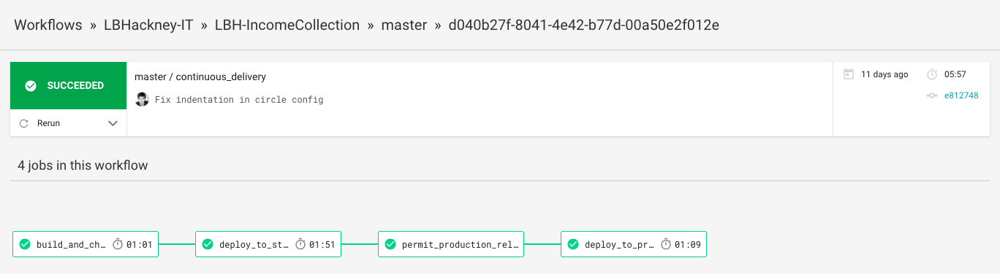

# Releasing

1. Log in to [CircleCI](https://app.circleci.com/pipelines/github/LBHackney-IT/LBH-IncomeCollection) with Github and connect to the repo.
2. Successful merges to the `master` branch are built automatically by CircleCI.
3. After a successful build, the application is automatically released to staging.
4. After manually reviewing on staging, when you're happy to release to production, click to permit.
5. The application will be automatically released to production.

The configuration for releasing changes is in [`.circleci/config.yml`](https://github.com/LBHackney-IT/LBH-IncomeCollection/blob/master/.circleci/config.yml)
